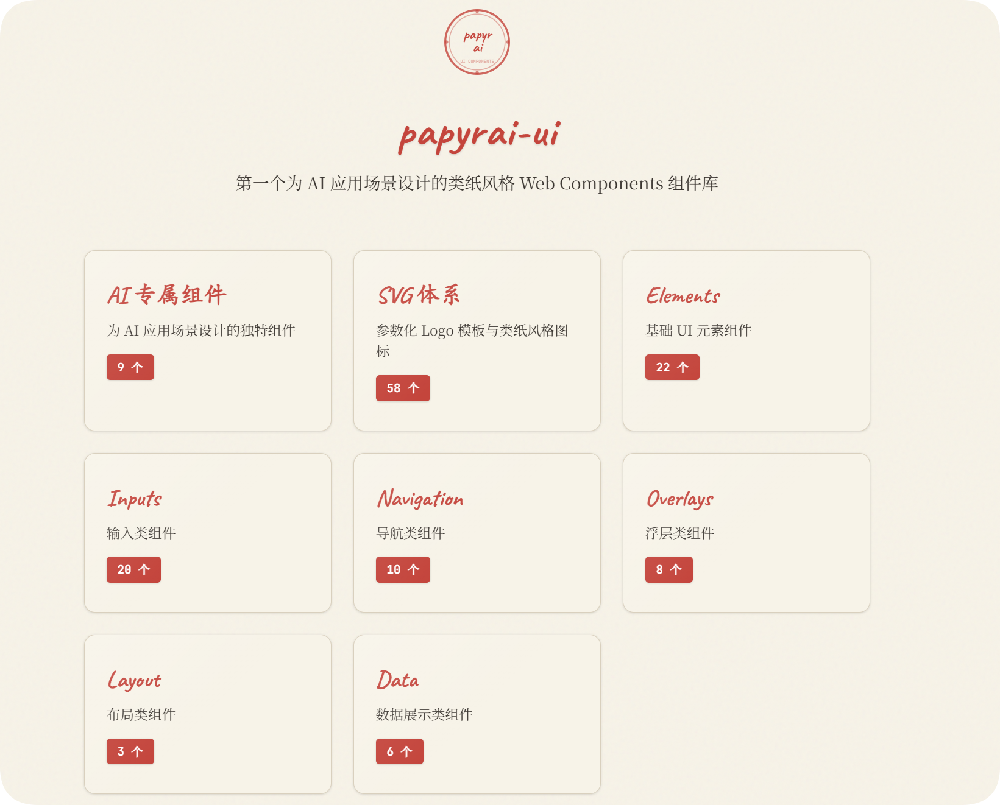
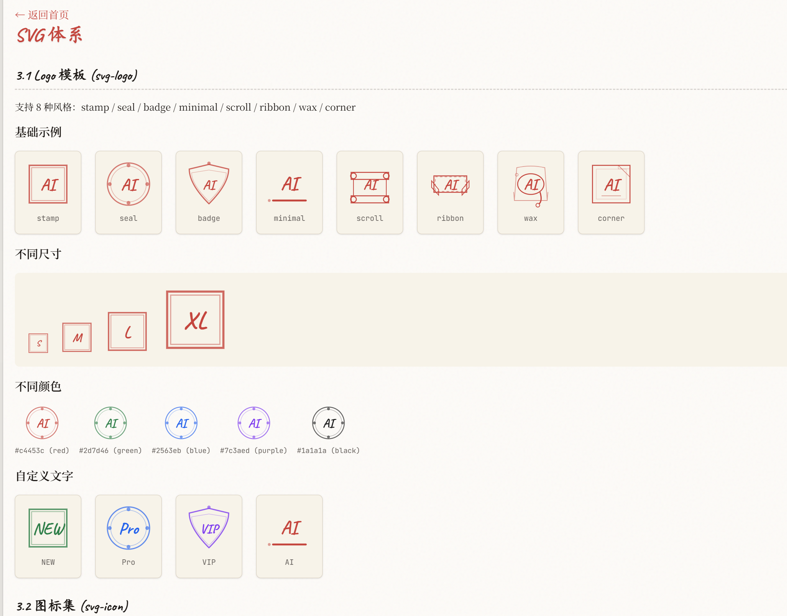

# papyrai-ui

> Paper-style Web Components for AI applications



## 是什么

一个类纸风格的 Web Components 组件库，专为 AI 应用场景设计。

灵感来源：既然有免费 AI，能不能做个完全免费、通用、原始的 AI UI？

**目前就是写着玩的阶段，Bug 多，勿喷。（且没太多时间和精力）**

---

## 文档版本

- [English README](docs/README-en.md)
- [中文文档](docs/README-zh.md)

## 预览




## 快速开始

```bash
npm install papyrai-ui
npm run dev
```

## 使用

```javascript
import 'papyrai-ui';
```

```html
<ai-thinking></ai-thinking>
<p-button>点击我</p-button>
```

## License

MIT


npm run build

npm pack

npm login 

npm publish